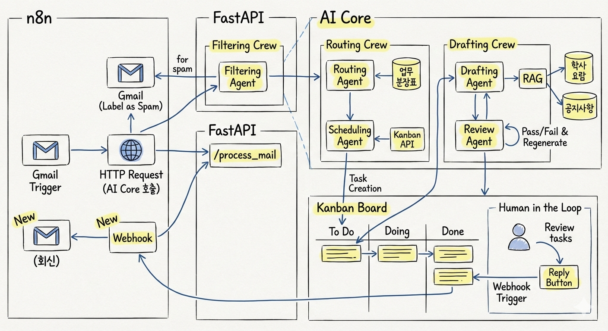
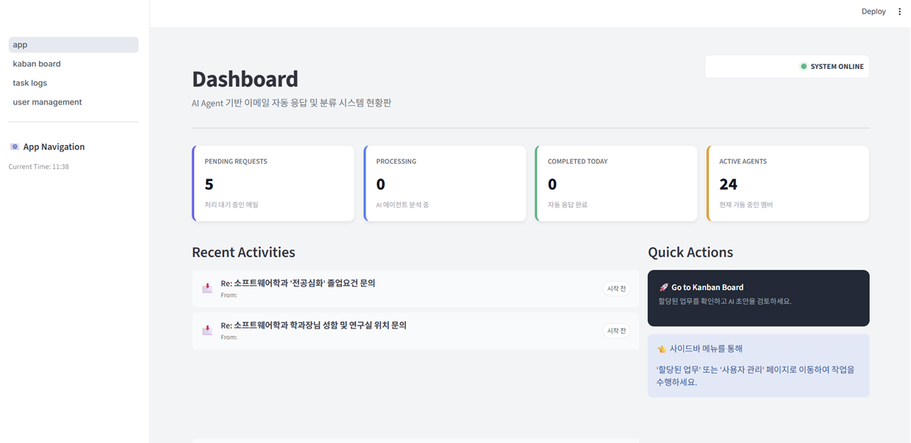

# 📧 AI Multi-Agent Administrative Email Assistant

### (AI 멀티 에이전트 기반 지능형 행정 이메일 자동 분류 및 응답 시스템)

> 학생과 행정실 간의 소통 비효율을 해결하는 End-to-End 자동화 솔루션 > CrewAI, n8n, 칸반 보드를 결합한 지능형 비서 시스템입니다.

---

##  목차 (Table of Contents)

1. [프로젝트 개요 (Overview)](https://www.google.com/search?q=%23-%ED%94%84%EB%A1%9C%EC%A0%9D%ED%8A%B8-%EA%B0%9C%EC%9A%94-overview&authuser=1)
2. [시스템 아키텍처 (Architecture)](https://www.google.com/search?q=%23-%EC%8B%9C%EC%8A%A4%ED%85%9C-%EC%95%84%ED%82%A4%ED%85%8D%EC%B2%98-architecture&authuser=1)
3. [주요 기능 및 에이전트 (Features & Agents)](https://www.google.com/search?q=%23-%EC%A3%BC%EC%9A%94-%EA%B8%B0%EB%8A%A5-%EB%B0%8F-%EC%97%90%EC%9D%B4%EC%A0%84%ED%8A%B8-features--agents&authuser=1)
4. [기술 스택 (Tech Stack)](https://www.google.com/search?q=%23-%EA%B8%B0%EC%88%A0-%EC%8A%A4%ED%83%9D-tech-stack&authuser=1)
5. [설치 및 실행 (Installation & Usage)](https://www.google.com/search?q=%23-%EC%84%A4%EC%B9%98-%EB%B0%8F-%EC%8B%A4%ED%96%89-installation--usage&authuser=1)
6. [핵심 기술 전략 (Key Strategies)](https://www.google.com/search?q=%23-%ED%95%B5%EC%8B%AC-%EA%B8%B0%EC%88%A0-%EC%A0%84%EB%9E%B5-key-strategies&authuser=1)
7. [스크린샷 (Screenshots)](https://www.google.com/search?q=%23-%EC%8A%A4%ED%81%AC%EB%A6%B0%EC%83%B7-screenshots&authuser=1)

---

##  프로젝트 개요 (Overview)

### 1. 배경 및 문제 정의

대학 행정 환경에서 이메일은 주요 소통 창구이지만, 다음과 같은 **구조적 비효율**이 존재합니다.

- **학생(User):** 복잡한 조직도로 인해 정확한 담당자를 찾기 어렵고, 단순 질의에도 답변을 기다려야 합니다.
- **행정 담당자(Staff):** 반복적인 단순 문의 답변, 잘못 배달된 메일의 재전송(토스) 업무로 인해 본연의 전문 업무에 집중하기 어렵습니다.

### 2. 해결 방안

**Multi-Agent AI 시스템**을 도입하여 이메일 접수부터 답변 초안 작성까지의 전 과정을 자동화합니다.

- 단일 이메일 창구를 통한 접수 및 **자동 담당자 배정 (Routing)**
- 학사 요람 및 규정집 기반의 **RAG(검색 증강 생성) 답변 초안 작성**
- **Human-in-the-Loop (HITL)**: AI가 작성한 초안을 담당자가 검토/수정 후 발송하는 안전장치(Kanban Board) 마련

### 3. 기대 효과

- **업무 효율성 증대:** 단순 반복 업무 자동화로 행정 담당자의 업무 부담 경감
- **소통 편의성 향상:** 학생들은 복잡한 조직도를 알 필요 없이 신속 정확한 답변 수신
- **확장성:** 학과 단위에서 단과대, 학교 전체로 확장 가능한 모듈형 아키텍처

---

## 시스템 아키텍처 (Architecture)

본 시스템은 **외부 인터페이스(n8n)**, **지능형 코어(Agent Server)**, **사용자 인터페이스(Kanban Board)**, **데이터베이스**의 4가지 핵심 요소로 구성됩니다.



### 전체 워크플로우 (End-to-End Workflow)

1. **수신 (Reception):** `n8n`이 Gmail을 모니터링하다가 새 메일을 감지하고 파싱합니다.
2. **분류 (Filtering):** `AI Agent`가 메일을 분석하여 **단순 질의 / 복잡한 업무 / 기타(스팸)**로 분류합니다.
3. **배정 (Routing):** 복잡한 업무인 경우, 업무분장표를 기반으로 최적의 담당자를 찾아 매핑합니다.
4. **생성 (Drafting):** `RAG`를 통해 학사 요람을 참조하여 답변 초안을 작성하고 검증합니다.
5. **검토 (HITL):** 생성된 초안이 `Kanban Board`에 등록됩니다. 담당자는 내용을 확인/수정 후 '회신' 버튼을 누릅니다.
6. **발송 (Reply):** `n8n` 웹훅이 트리거되어 최종 메일이 학생에게 발송됩니다.

---

## 주요 기능 및 에이전트 (Features & Agents)

CrewAI 프레임워크를 사용하여 각기 다른 역할을 가진 전문화된 에이전트들이 협업합니다.

| **에이전트 / 기능** | **역할 및 설명** |
| --- | --- |
| **Filtering Agent** | 이메일의 의도를 파악하여 3가지 카테고리(`Task`, `Simple Inquiry`, `Other`)로 분류합니다. 스팸이나 광고는 즉시 필터링합니다. |
| **Routing Agent** | 업무분장표(JSON)를 분석하여 문의 내용에 가장 적합한 담당자 1명을 찾아냅니다. (정확도 93% 달성) |
| **Drafting Agent** | **RAG(검색 증강 생성)** 기술을 사용하여 학사 요람, FAQ 등 내부 문서를 참조, 사실에 기반한 답변 초안을 작성합니다. |
| **Validation Agent** | LLM-as-a-Judge 방법론을 적용하여 작성된 초안의 사실성(Factuality)과 관련성(Relevance)을 평가하고, 기준 미달 시 재생성을 요청합니다. |
| **Scheduling & Kanban** | 담당자의 업무 부하를 확인하고, 최종 결과를 칸반 보드 태스크로 생성하여 인간의 검토를 요청합니다. |

---

## 기술 스택 (Tech Stack)

- **AI Framework:** `CrewAI` (Multi-Agent Orchestration), `LangChain`
- **Workflow Automation:** `n8n` (Self-hosted)
- **Backend API:** `FastAPI`
- **Dashboard:** `Streamlit`
- **Database & Storage:**
    - Vector DB: `ChromaDB` (Academic Regulations RAG)
    - RDBMS: `PostgreSQL` (User & Task Data)
    - Object Storage: `MinIO` (PDF & Files)
- **LLM:** OpenAI `GPT-4o` (Drafting), `GPT-4o-mini` (Routing/Filtering - Cost Optimized)
- **Infrastructure:** `Docker`, `Docker Compose`

---

## 설치 및 실행 (Installation & Usage)

본 프로젝트는 Docker Compose를 통해 한 번에 모든 서비스를 실행할 수 있도록 구성되었습니다.

### 1. 사전 요구사항 (Prerequisites)

- Docker & Docker Compose 설치
- OpenAI API Key 준비

### 2. 환경 변수 설정 (Environment Setup)

프로젝트 루트에 `.env` 파일을 생성하고 다음 변수들을 설정하세요.
(MinIO, DB, n8n 설정 등)

```Bash
# agent 설정
CREWAI_TELEMETRY_ENABLED=false
OPENAI_API_KEY=your_api_key_here

# MinIO 설정
MINIO_BUCKET=your_minio_bucket
MINIO_ACCESS_KEY=your_minio_access_key
MINIO_SECRET_KEY=your_minio_secret_key

# Kanban DB (PostgreSQL) 설정
KANBAN_DB_NAME=database_name
KANBAN_DB_USER=user_name
KANBAN_DB_PASSWORD=user_password

# RAG / Data-Pipeline 설정
CHROMA_HOST=chromadb
CHROMA_PORT=8000
CHROMA_COLLECTION_NAME=collection_name
EMBEDDING_MODEL=jhgan/ko-sroberta-multitask
DEVICE_TYPE=cpu
```

### 3. 실행 (Run)

```Bash
# 저장소 클론
git clone https://github.com/your-repo/ai-email-agent.git
cd ai-email-agent
docker-compose up --build -d
```

### 4. 접속 (Access)

- **Kanban Board (UI):** `http://localhost:8501`
- **n8n (Workflow):** `http://localhost:5678`
- **API Docs:** `http://localhost:8001/docs` (Agent), `http://localhost:8002/docs` (Kanban)

---

---

## 칸반보드

- 담당자 할당 및 초안 검토 (Kanban Board)

    AI가 생성한 답변 초안을 담당자가 확인하고 수정할 수 있는 대시보드입니다.

- 사용자(담당자) 관리

    담당자의 상태(휴가, 업무 과부하 등)를 관리하여 AI의 배정 로직에 반영합니다.


---

## 🔗 References & License

- [CrewAI Documentation](https://docs.crewai.com/)
- [n8n Documentation](https://docs.n8n.io/)